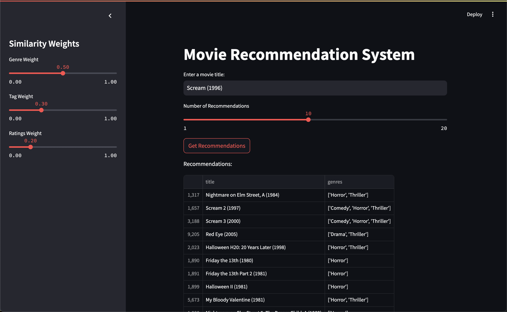

# Movie Recommendation System

Welcome to the **Movie Recommendation System** project! This project showcases a robust recommendation engine powered by data preprocessing, advanced similarity computation, and a user-friendly **Streamlit** web app. The system demonstrates a variety of technical and analytical skills, such as data engineering, machine learning, and backend/frontend integration.

---

## Project Overview

The **Movie Recommendation System** provides personalized movie recommendations using a combination of genres, user-generated tags, and movie ratings. It allows users to:

- Search for a movie title and receive tailored recommendations.
- Adjust the importance (weights) of genres, tags, and ratings to fine-tune the recommendations.
- Visualize and interact with results in a minimalist yet functional web interface.

---

## Features

### Backend Features:

1. **Blended Similarity Computation**:

   - Combines **genre similarity**, **tag similarity**, and **ratings similarity** into a weighted scoring system.
   - Dynamic weighting: Users can customize how much each factor contributes to recommendations.

2. **Preprocessing Pipeline**:

   - Cleans raw datasets and generates precomputed similarity matrices for fast query response.
   - Handles missing values, malformed data, and edge cases to ensure robustness.

3. **Efficient Recommendation Logic**:

   - Utilizes **cosine similarity** and **TF-IDF vectorization** for high-quality recommendations.
   - Includes threshold-based filtering to ensure only relevant movies are recommended.

### Frontend Features:

1. **Streamlit Web App**:

   - Clean and intuitive interface.
   - Input field for searching movie titles.
   - Sliders for adjusting blending weights for genres, tags, and ratings.
   - Tabular display of recommendations with associated genres, tags, and average ratings.

2. **Interactivity**:

   - Allows real-time fine-tuning of recommendation logic via weight sliders.
   - Provides quick feedback on recommendations based on user input.

---

## How to Run the Project

### Prerequisites

- Python 3.9+
- Install dependencies listed in `requirements.txt`

### Steps to Run Locally

1. Clone the repository:

   ```bash
   git clone https://github.com/ethanwong3/movieRecs.git
   cd movie-recommendation-system
   ```

2. Install required Python packages:

   ```bash
   pip install -r requirements.txt
   ```

3. Preprocess the data and generate similarity matrices:

   ```bash
   python3 src/init.py
   ```

4. Run the Streamlit app:

   ```bash
   streamlit run app/main.py
   ```

5. Open the app in your browser using the local URL provided (e.g., `http://localhost:8501`).

---

## Datasets Used

- **Movies Dataset**: Contains movie titles, genres, and metadata.
- **Tags Dataset**: User-generated tags for movies.
- **Ratings Dataset**: Average user ratings for movies.

All datasets are preprocessed to clean missing or invalid data and stored in the `data` folder.

---

## Technical Details

### Backend Pipeline

1. **Data Cleaning**:

   - Missing genres and tags are replaced with default placeholders (`unknown`).
   - Invalid or incomplete entries are removed to ensure data quality.

2. **Similarity Computation**:

   - **Genres**: TF-IDF vectorization on genres followed by cosine similarity.
   - **Tags**: Similar TF-IDF-based approach using user-generated tags.
   - **Ratings**: Pearson correlation similarity computed based on average ratings.

3. **Recommendation Logic**:

   - Blends genre, tag, and ratings similarities using user-defined weights.
   - Returns the top N most similar movies based on the final blended score.

### Streamlit App

- Built using Streamlit to ensure a lightweight and interactive user experience.
- Features sliders for custom weight adjustments and a dynamic recommendation display.

---

## Screenshots of App Interface



---

## Future Improvements

1. **Metadata Integration**:

   - Incorporate additional data (e.g., cast, director, release year) into the recommendation algorithm.

2. **Collaborative Filtering**:

   - Add user-based or item-based collaborative filtering for more personalized results.

3. **Hosting**:

   - Deploy the app using Streamlit Cloud or other hosting services for public access.

4. **UI Enhancements**:

   - Improve the app design for a more professional and visually appealing interface.

5. **Advanced ML Models**:

   - Explore deep learning-based recommendation techniques (e.g., embeddings).

---

## Why This Project is Unique

1. **Customizability**:

   - Blending weights empower users to tailor recommendations to their preferences.

2. **Scalable Architecture**:

   - Precomputed similarity matrices ensure quick responses, even for large datasets.

3. **Strong Technical Stack**:

   - Demonstrates proficiency in Python, Pandas, NumPy, scikit-learn, and Streamlit.

4. **Real-World Relevance**:

   - Showcases a practical application of recommendation systems, a highly sought-after skill in industries like e-commerce, entertainment, and tech.

---

## Acknowledgements

- **Datasets**: Publicly available movie datasets used in the project.
- **Tools**: Built with Python, Pandas, NumPy, scikit-learn, and Streamlit.
- **Inspiration**: Practical application of machine learning techniques in recommendation systems.

---

Feel free to reach out for any questions or suggestions!
